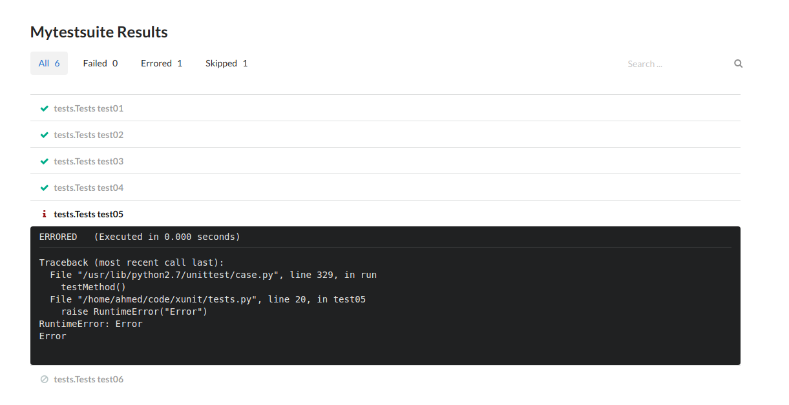

## Junit2Html

### Installation
```bash
pip install https://github.com/ahmedelsayed-93/junit2html
```
### Usage
```bash
junit2html --file junit-file.xml --output html-file.html 
```

### Screenshots
